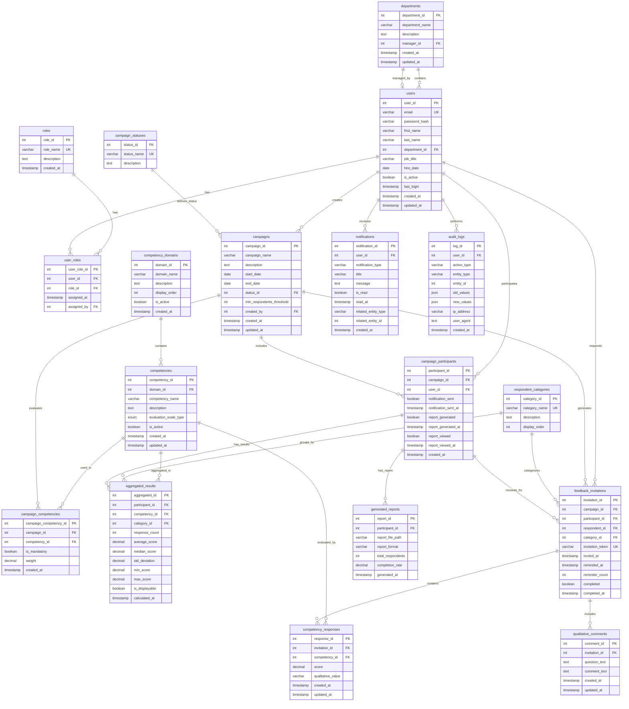

```mermaid
erDiagram
    %% TABLES DE RÉFÉRENCE
    roles ||--o{ user_roles : "has"
    roles {
        int role_id PK
        varchar role_name UK
        text description
        timestamp created_at
    }
    
    departments ||--o{ users : "contains"
    departments ||--o| users : "managed_by"
    departments {
        int department_id PK
        varchar department_name
        text description
        int manager_id FK
        timestamp created_at
        timestamp updated_at
    }
    
    competency_domains ||--o{ competencies : "contains"
    competency_domains {
        int domain_id PK
        varchar domain_name
        text description
        int display_order
        boolean is_active
        timestamp created_at
    }
    
    competencies ||--o{ campaign_competencies : "used_in"
    competencies ||--o{ competency_responses : "evaluated_by"
    competencies ||--o{ aggregated_results : "aggregated_in"
    competencies {
        int competency_id PK
        int domain_id FK
        varchar competency_name
        text description
        enum evaluation_scale_type
        boolean is_active
        timestamp created_at
        timestamp updated_at
    }
    
    %% TABLES UTILISATEURS
    users ||--o{ user_roles : "has"
    users ||--o{ campaigns : "creates"
    users ||--o{ campaign_participants : "participates"
    users ||--o{ feedback_invitations : "responds"
    users ||--o{ notifications : "receives"
    users ||--o{ audit_logs : "performs"
    users {
        int user_id PK
        varchar email UK
        varchar password_hash
        varchar first_name
        varchar last_name
        int department_id FK
        varchar job_title
        date hire_date
        boolean is_active
        timestamp last_login
        timestamp created_at
        timestamp updated_at
    }
    
    user_roles {
        int user_role_id PK
        int user_id FK
        int role_id FK
        timestamp assigned_at
        int assigned_by FK
    }
    
    %% TABLES CAMPAGNES
    campaign_statuses ||--o{ campaigns : "defines_status"
    campaign_statuses {
        int status_id PK
        varchar status_name UK
        text description
    }
    
    campaigns ||--o{ campaign_participants : "includes"
    campaigns ||--o{ campaign_competencies : "evaluates"
    campaigns ||--o{ feedback_invitations : "generates"
    campaigns {
        int campaign_id PK
        varchar campaign_name
        text description
        date start_date
        date end_date
        int status_id FK
        int min_respondents_threshold
        int created_by FK
        timestamp created_at
        timestamp updated_at
    }
    
    respondent_categories ||--o{ feedback_invitations : "categorizes"
    respondent_categories ||--o{ aggregated_results : "groups_by"
    respondent_categories {
        int category_id PK
        varchar category_name UK
        text description
        int display_order
    }
    
    campaign_participants ||--o{ feedback_invitations : "receives_for"
    campaign_participants ||--o{ aggregated_results : "has_results"
    campaign_participants ||--o{ generated_reports : "has_report"
    campaign_participants {
        int participant_id PK
        int campaign_id FK
        int user_id FK
        boolean notification_sent
        timestamp notification_sent_at
        boolean report_generated
        timestamp report_generated_at
        boolean report_viewed
        timestamp report_viewed_at
        timestamp created_at
    }
    
    campaign_competencies {
        int campaign_competency_id PK
        int campaign_id FK
        int competency_id FK
        boolean is_mandatory
        decimal weight
        timestamp created_at
    }
    
    %% TABLES FEEDBACKS
    feedback_invitations ||--o{ competency_responses : "contains"
    feedback_invitations ||--o{ qualitative_comments : "includes"
    feedback_invitations {
        int invitation_id PK
        int campaign_id FK
        int participant_id FK
        int respondent_id FK
        int category_id FK
        varchar invitation_token UK
        timestamp invited_at
        timestamp reminded_at
        int reminder_count
        boolean completed
        timestamp completed_at
    }
    
    competency_responses {
        int response_id PK
        int invitation_id FK
        int competency_id FK
        decimal score
        varchar qualitative_value
        timestamp created_at
        timestamp updated_at
    }
    
    qualitative_comments {
        int comment_id PK
        int invitation_id FK
        text question_text
        text comment_text
        timestamp created_at
        timestamp updated_at
    }
    
    %% TABLES AGRÉGATION ET RAPPORTS
    aggregated_results {
        int aggregated_id PK
        int participant_id FK
        int competency_id FK
        int category_id FK
        int response_count
        decimal average_score
        decimal median_score
        decimal std_deviation
        decimal min_score
        decimal max_score
        boolean is_displayable
        timestamp calculated_at
    }
    
    generated_reports {
        int report_id PK
        int participant_id FK
        varchar report_file_path
        varchar report_format
        int total_respondents
        decimal completion_rate
        timestamp generated_at
    }
    
    %% TABLES SYSTÈME
    notifications {
        int notification_id PK
        int user_id FK
        varchar notification_type
        varchar title
        text message
        boolean is_read
        timestamp read_at
        varchar related_entity_type
        int related_entity_id
        timestamp created_at
    }
    
    audit_logs {
        int log_id PK
        int user_id FK
        varchar action_type
        varchar entity_type
        int entity_id
        json old_values
        json new_values
        varchar ip_address
        text user_agent
        timestamp created_at
    }
```
